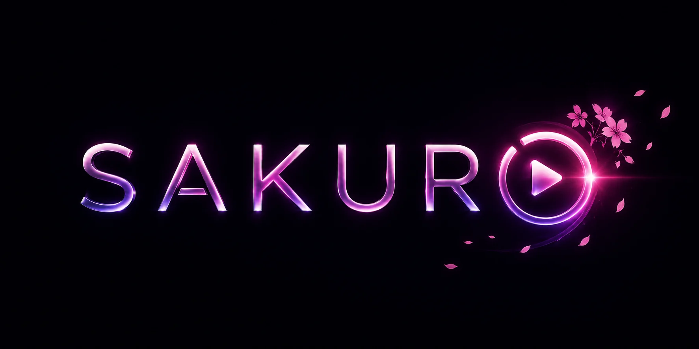

# Sakuro

[](LICENSE)
[](https://kotlinlang.org/)
[](https://www.jetbrains.com/lp/compose-multiplatform/)
[](composeApp/build.gradle.kts)
[](#project-status)
[](#licensing)



Sakuro is a Kotlin Multiplatform video player focused on local Android playback and real-time upscaling through Media3.

The Android app is the main product target. The Desktop/JVM target is kept as a fast UI and architecture sandbox, using a fake player engine where native Android playback is unavailable. libmpv is kept as a developer/reference path for shader comparison and parity testing rather than the primary product runtime.

## Highlights

- Local video library on Android through MediaStore, plus manual file opening through the system picker.
- **Media3/ExoPlayer** as the Android product playback engine, with hardware decoding and GLSL ES effects through Media3 video effects.
- A shared `PlayerEngine` abstraction for Media3, fake desktop/testing, and libmpv reference workflows.
- **libmpv** reference tooling through `dev.jdtech.mpv:libmpv`, used to run upstream mpv `.glsl` shaders, capture comparison output, and guide Media3 ports.
- Real-time upscale presets for anime, cartoon, and live-action content.
- Media3 Anime4K shader runtime that parses mpv-style user shaders and executes a multi-pass render graph.
- Debug overlay with engine, decoder, codec, resolution, FPS, dropped frames, bitrate, audio, active preset, detection, adaptive state, and device signals.
- Content detection from filenames and sampled frames, with automatic preset selection and manual override.
- Adaptive playback controller for thermal, battery, power-save, and dropped-frame conditions.
- Gesture-first player controls: tap, double-tap seek, long-press speed, seek swipe, brightness/volume swipe, and pinch scale modes.
- Settings backed by multiplatform settings: default preset, debug overlay, adaptive mode, gesture controls, and preset import/export.
- `foss` and `full` Android flavors. They are currently equivalent and do not include proprietary SDKs.

## Project Status

Sakuro is an early Android-first open-source project. It is suitable for development, testing, and technical review, but the playback and shader pipeline should still be treated as young software.

Verified locally:

- Android debug and release builds.
- Unit tests across core modules, Media3 shader planning/parsing, mpv reference mapping, library organization, settings, gestures, detection, and adaptive control.
- Media3 playback with live preset switching and upscaled output on an emulator.

Known practical limits:

- Real-device profiling for the Media3 Anime4K path is still important before calling the shader runtime production-stable.
- libmpv should stay out of normal product packaging unless a specific distribution accepts the APK size and GPL tradeoff.
- DRM/protected streams are out of scope because decoded frames are not available to custom effects.
- Desktop is a UI sandbox, not a full desktop media player.

## Screens And Experience

The app is designed around a quiet full-screen player, a focused local library, and advanced controls that stay out of the way until needed. The visual system uses Compose Material 3, custom Sakuro colors, Inter typography, and Lucide icons.

Useful project documents:

- [ARCHITECTURE.md](ARCHITECTURE.md) - module boundaries, engine strategy, flavors, and licensing notes.
- [FEATURES.md](FEATURES.md) - product feature map and implementation ownership.
- [DESIGN.md](DESIGN.md) - interface principles, layout direction, and visual tokens.
- [BRAND.md](BRAND.md) - name, voice, logo, palette, and asset rules.
- [CHANGELOG.md](CHANGELOG.md) - notable changes by version.
- [PRIVACY.md](PRIVACY.md) - local data handling and benchmark privacy notes.

## Build And Run

Requirements:

- JDK 17 or newer.
- Android SDK.
- `local.properties` with `sdk.dir=...` for Android builds.

Build the Android app:

```bash
./gradlew :composeApp:assembleFossDebug
```

Install the debug APK:

```bash
adb install -r composeApp/build/outputs/apk/foss/debug/composeApp-foss-debug.apk
```

Build a release APK:

```bash
./gradlew :composeApp:assembleFossRelease
```

Run the desktop UI sandbox:

```bash
./gradlew :composeApp:desktopRun
```

Run tests:

```bash
./gradlew test
```

Run static analysis:

```bash
./gradlew detekt
```

## Benchmarking

Sakuro includes `tools/sakuro-bench`, a local benchmark and comparison utility for shader work. It is useful when checking Media3 output against mpv-based reference renders and when measuring whether an upscale path actually improves objective quality instead of only adding GPU cost.

```bash
cd tools/sakuro-bench
python -m venv .venv
. .venv/bin/activate
pip install -r requirements.txt
python -m sakuro_bench --help
```

Generated captures and reports are local artifacts and are ignored by git.

See [tools/sakuro-bench/README.md](tools/sakuro-bench/README.md) for the full methodology, metric definitions, capture workflow, report format, and limitations.

## Module Layout

```text
composeApp/            Compose UI, navigation, Android entry point, Desktop sandbox
core/core-player/      PlayerEngine API, state, tracks, debug stats, engine registry
core/core-upscale/     Upscale profiles, built-in presets, stores, adaptive controller
core/core-media/       Media library model, Android MediaStore integration, desktop samples
core/core-detect/      Filename and frame-sample content classification
core/core-settings/    Persisted app settings
engine/engine-media3/  Media3/ExoPlayer engine and GLSL ES upscale effects
engine/engine-mpv/     Developer/reference libmpv path, shader store, mpv property mapping
engine/engine-fake/    Fake engine for desktop UI and tests
build-logic/           Shared Gradle convention plugins
tools/sakuro-bench/    Local benchmark utility for shader/output comparisons
licenses/              Third-party license texts for vendored assets
assets/branding/       Source branding assets
```

## Licensing

Sakuro is currently distributed under the [GNU General Public License v3.0](LICENSE) because libmpv is present in the repository. Product builds should avoid shipping libmpv unless that GPL and APK-size tradeoff is intentional. Vendored Anime4K shaders and Inter font assets keep their original licenses under [licenses/](licenses/).

Review [ARCHITECTURE.md](ARCHITECTURE.md) for licensing notes around engines, flavors, and third-party dependencies.

## Contributing

Small, focused contributions are welcome: build issues, documentation corrections, reproducible playback bugs, benchmark improvements, and test-backed engine fixes are easiest to review.

Before opening a pull request, read [CONTRIBUTING.md](CONTRIBUTING.md) and the [Code of Conduct](CODE_OF_CONDUCT.md).

For security reports, please follow [SECURITY.md](SECURITY.md) and do not open a public issue.

When reporting playback or quality problems, include:

- Device/OS details for playback and shader issues.
- Whether the issue is in the Media3 product path or the libmpv reference path.
- Video codec, resolution, and container when relevant.
- Logs or screenshots for visual/rendering bugs.
